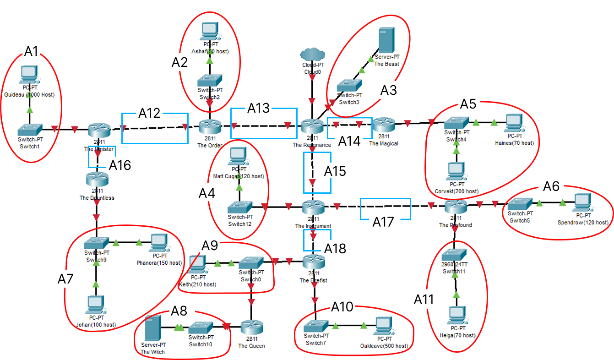
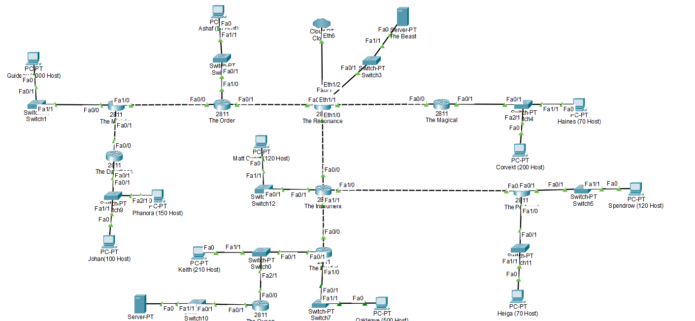
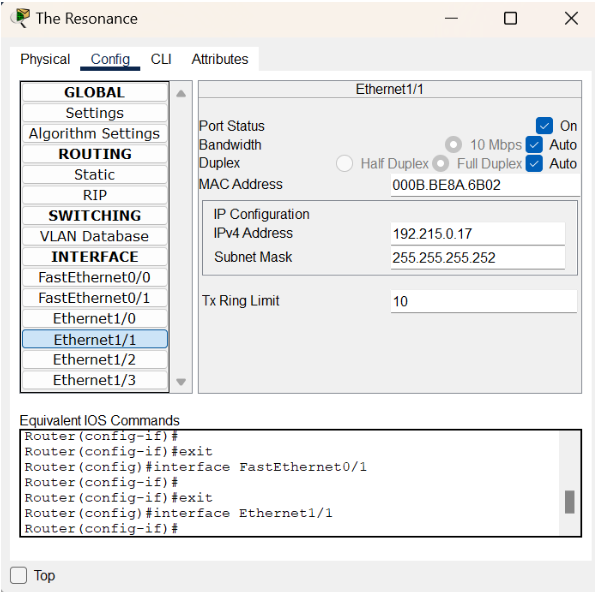
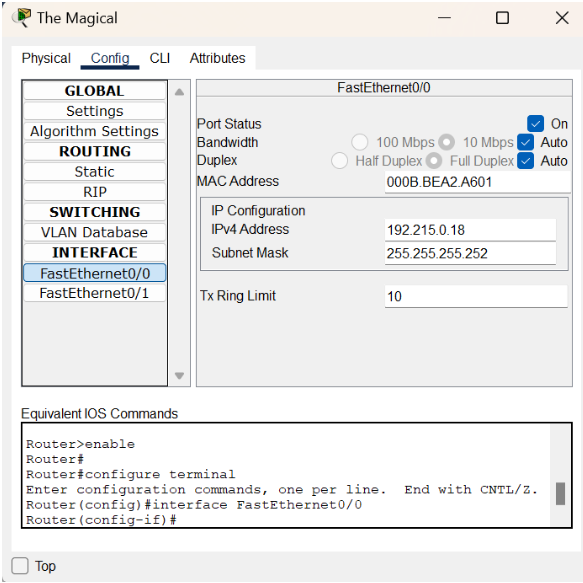
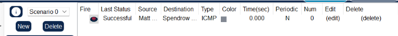

# Jarkom-Modul-4-ITB02-2022

Anggota kelompok:

1. Asima Prima Y. Tampubolon 5027201009
2. Cherylene Trevina 5027201033
3. Fatih Rian Hibatul Hakim 5027201066

## Daftar Isi

* [Soal](#soal)
* [Jumlah Kebutuhan IP](#jumlah-kebutuhan-ip)
* [VLSM](#vlsm)
* [CIDR](#cidr)
* [Setting Cisco](#setting-cisco)
* [Kendala](#kendala)

## Soal


Pembuatan Subnetting & Pohon VLSM dan CIDR serta Config Cisco Packet Tracer & GNS3

## Jumlah Kebutuhan IP



Berikut adalah jumlah kebutuhan IP yang diperlukan dalam topologi yang telah dibuat


Berikut adalah jumlah prefix yang diperlukan

| Mask | Jumlah |
| --- | --- |
| /22 | 1 |
| /23 | 2 |
| /24 | 2 |
| /25 | 3 |
| /26 | 1 |
| /30 | 9 |
| Total | 18 |

Jumlah host total: `2618` dengan netmask: `/20`

## VLSM

Pertama, buat pohon pembagian ip sebagai berikut


daripohon tersebut, bisa dibuattabel perhitungan VLSM dari pohon yang sudah dipaparkan


## CIDR

Berikut adalah langkah langkah yang dilakukan dalam mengkombinasikan subnet untuk CIDR:

1. 
2. 
3. 
4. 
5. 
6. 
7. 
8. 

Berikut adalah tabel kesimpulan untuk kombinasi-kombinasi CIDR yang telah dilakukan.


Oleh karena itu, pohon CIDR dimulai dengan netmask `/16`. Sehingga pohon yang digunakan untuk subnet CIDR adalah:


Setelah pohon tersebut sudah diselesaikan, dibuat tabel subnetting CIDR, yaitu:


## Setting Cisco
Pertama sekali kami mengatur topologi jaringan seperti berikut



Untuk pengaturan IP, kami mengatur IP berdasarkan table perhitungan yang telah kami buat, lalu kami mengassign IP tersebut kedalam setiap node. Sebagai Contoh kita ambil subnet A14.

Subnet A3 : 
    Network ID : 192.215.0.16
    Netmask : 255.255.255.252
    IP range : 192.215.0.17 - 192.215.0.18

berdasarkan data tersebut, maka kita dapat mengatur nya pada cisco packet tracer nya. Pada The Reisonance dapat kita lihat bahwa interface yang terhubung dengan subnet A14 adalah eth1/1. maka IP pada interface eth1/1 yang kita atur dengan IP range yang tersedia sebagai berikut :



Selanjutnya kita mengatur IP pada The magical sebagai berikut:



Setelah berhasil mengatur IP pada subnet A14 maka kita lanjutkan mengkonfigurasi IP sampai seluruh subnet berhasil di konfigurasi.

Routing
Setelah semua subnet telah berhasil diatur IP nya  maka kita akan melakukan routing agar semua node saling terhubung. Sebagai contoh kita ambil route The Order:
The Order harus terhubung ke A1.
The Order harus terhubung ke A16.
Subnet A1 dan A16 terhubung ke The Minister
Oleh karena itu next hop dari A1 dan A2 adalah The Minister yang terhubung ke The Order

Maka setting routing nya adalah sebagai berikut
```
* 0.0.0.0/0 via 192.215.0.13
* 192.215.8.0/22 via 192.215.0.10
* 192.215.0.24/30 via 192.215.0.10
* 192.215.0.20/30 via 192.215.0.13
*192.215.0.16/30 via 192.215.0.13
* 192.215.0.0/30 via 192.215.0.13
```

Berikut adalah routing untuk setiap router

The Dauntiess
```
* 192.215.8.0/22 via 192.215.0.25
* 192.215.0.8/30 via 192.215.0.25
```
The Minister
```
* 192.215.0.64/26 via 192.215.0.9
*192.215.0.12/30 via 192.215.0.9
* 192.215.2.0/24 via 192.215.0.26
```
The Resonance
```
* 192.215.0.8/30 via 192.215.0.14
* 192.215.0.64/30 via 192.215.0.14
* 192.215.6.0/23 via 192.215.0.18
* 192.215.0.128/25 via 192.215.0.22
* 192.215.0.28/30 via 192.215.0.22
```
The Magical
```
* 0.0.0.0/0 via 192.215.0.17
* 192.215.0.12/30 via 192.215.0.17
* 192.215.0.20/30 via 192.215.0.17
```
The Instrument
```
* 0.0.0.0/0 via 192.215.0.21
* 192.215.1.128/25 via 192.215.0.30
* 192.215.1.0/25 via 192.215.0.30
* 192.215.0.12/30 via 192.215.0.21
* 192.215.0.16/30 via 192.215.0.21
* 192.215.3.0/24 via 192.215.0.34
* 192.215.4.0/23 via 192.215.0.34
```
The Firefist
```
* 192.215.0.128/25 via 192.215.0.33
* 192.215.0.128/25 via 192.215.0.129
```
The Queen
```
* 192.215.0.32/30 via 192.215.3.1
* 192.215.4.0/23 via 192.215.3.1
```
The Profound
```
* 192.215.0.128/25 via 192.215.0.29
* 192.215.0.20/30 via 192.215.0.29
```
Dengan melakukan routing seperti itu, kita sudah dapat memastikan bahwa semua node sudah terhubung. Sebagai contoh kita ambil Matt Cougat - Spendrow.




## Kendala

* Kesulitan dalam menconfig dalam GNS3
* Dalam melkakukan konfigurasi pada cisco terkadang cisconya failed sendiri sehingga waktu demo ketika melakukan ping kurang maksimal
